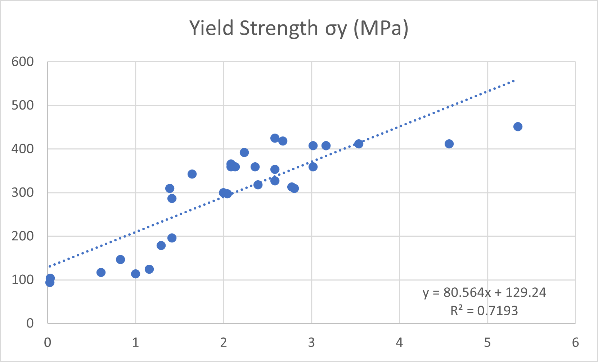
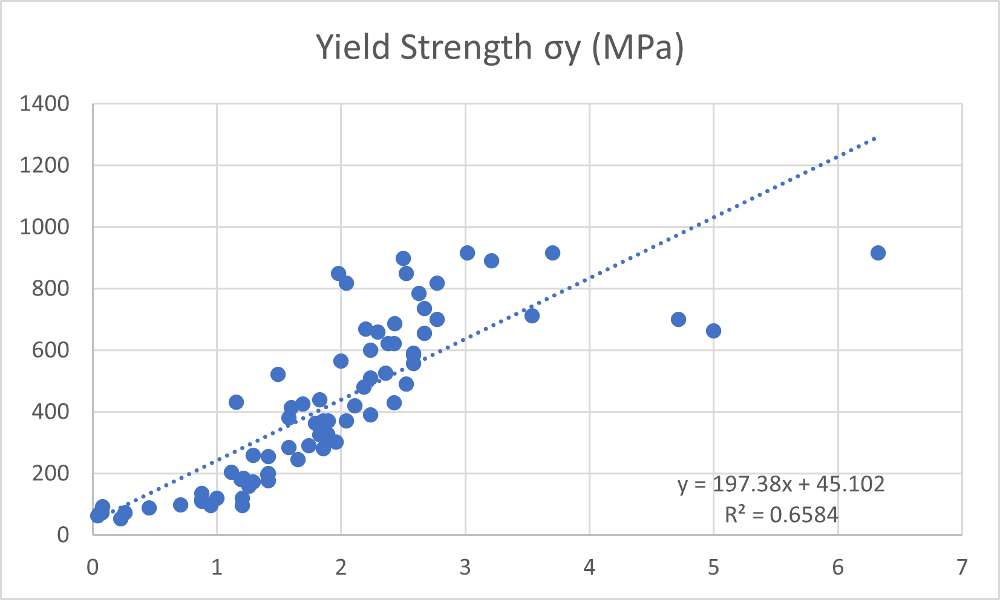

# Data-Driven Investigation of the Hall–Petch Relationship Using Literature-Derived Materials Data

## Project Description

This project examines the Hall–Petch relationship using grain size and yield strength data collected from published literature on magnesium and aluminum alloys. The objective is to study the influence of grain refinement on mechanical strength and evaluate the applicability of the Hall–Petch equation across different material systems.

## Hall–Petch Equation

σy = σ₀ + kd⁻¹ᐟ²

where:

- σy = Yield Strength (MPa)
- σ₀ = Friction Stress (MPa)
- k = Hall–Petch Coefficient
- d = Average Grain Size (µm)

## Methodology

1. Collection of literature-derived grain size and yield strength data.
2. Calculation of inverse square root grain size (d⁻¹ᐟ²).
3. Construction of Hall–Petch plots.
4. Linear regression analysis.
5. Determination of Hall–Petch constants (k and σ₀).
6. Comparison between magnesium and aluminum alloy systems.

## Results

| Material System | k (MPa·µm¹ᐟ²) | σ₀ (MPa) | R² |
|----------------|---------------|----------|--------|
| Magnesium Alloys | 80.56 | 129.24 | 0.7193 |
| Aluminum Alloys | 197.38 | 45.10 | 0.6584 |

## Hall–Petch Plots

### Magnesium Alloys

### Aluminum Alloys

## Key Findings

- Yield strength increases with decreasing grain size in both material systems.
- Aluminum alloys exhibit a higher Hall–Petch coefficient than magnesium alloys.
- The analysis confirms the role of grain-boundary strengthening in improving mechanical properties.

## Files Included

- Experimental datasets
- Hall–Petch analysis workbook
- Magnesium Hall–Petch plot
- Aluminum Hall–Petch plot

## Author

Gaddam Lakshmi Narayana  
Metallurgical and Materials Engineering  
VNIT Nagpur
